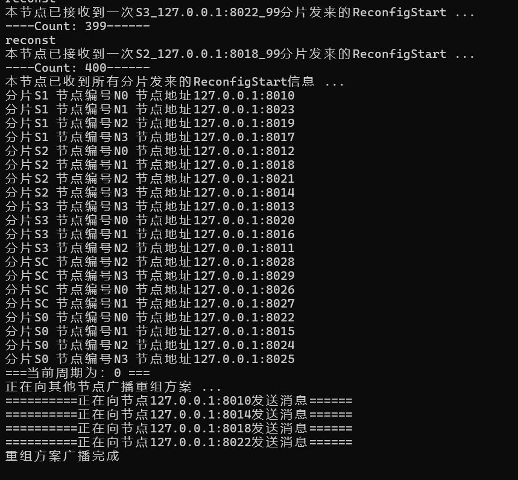

# Description
This branch, **tMPT**, contains the source code for the paper **tMPT: Reconfiguration across Blockchain Shardsvia Trimmed Merkle Patricia Trie** (IWQoS'23). Detailed information about this branch can be found in the paper.

# Preparations 
## Install Go & Get Go Packages
You can download Golang from this website (https://go.dev/doc/install). 

After installing Golang, you should run `go get .` or `go mod tidy` to download the packages this program needs. 


## Dataset
We have provided the dataset `./len3.csv`. 
So you do not need to download datasets from other websites. 

This dataset has 3 columns, i.e., `from`, `to`, and `value`. 
- from. The **payer** of a transaction. 
- to. The **payee** of a transaction. 
- value. The **transfer amount** of a transaction. 


## Network configuration
The network configuration can be found in `./params/config.go`. 

```Go
var (
	ClientAddr = "127.0.0.1:8200"
	NodeTable  = map[string]map[string]string{
        "S0": {
			"N0": "127.0.0.1:8010",
		},
        // ......
	}
    // ......
)
```

## Parameter Setting
### tMPT / Reconfiguration parameters
Especially, the parameter about **tMPT frequency** is defined in `pbft\config.go`. 
```Go
num_block_per_epoch = 100
```
This parameter `num_block_per_epoch` controls the frequency of reconfiguration. Specifically, when the number of blocks in each shard reaches `num_block_per_epoch`, a reconfiguration is triggered. After the reconfiguration is completed, the blockchain system enters the next Epoch.

**Tip**: When the value of `num_block_per_epoch` is large, the interval between reconfigurations will become longer.


### Normal parameters
Some parameters about *PBFT consensus* can be found in `./params/config.go`.

# Batch Running

## Start
You can run `./run4shard.bat`(**Windows**) or `run4.sh`(**Linux/MacOS**, not suggested) to start 21 nodes. 

## During operation
When the SC nodes collect `shardNumber * num_block_per_epoch` messages from worker shards, the reconstruction will be triggered. 



(**From the node who runs this cmd: `go run main.go -S 4 -f 1 -s SC -n N0`**)


Here, `shardNumber=4` and `num_block_per_epoch=100`. 

When collecting `400` ReconfigStart messages, the reconfiguration message is broadcast. 

# Collecting Results
The time and data cost of reconfigurations can be found in `./log/reconfig_time_per_epoch.csv` and `./log/S0_reconfig_data.csv`. 

All results are in `./log`. 

# Additional Information
**Earlier version**: This work is built on an earlier version of **BlockEmulator**, so the code structure does not match the current `main` branch.  
**Omitted some security implementations**: Some features related to security or validation, such as Merkle proof and validation, are not implemented in this code. These features are discussed in other papers and are not central to this work.
