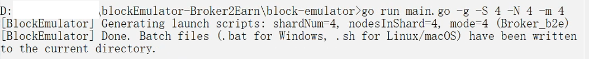
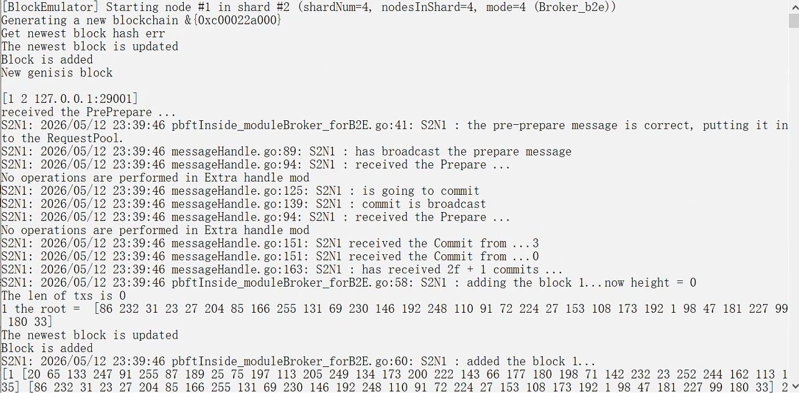
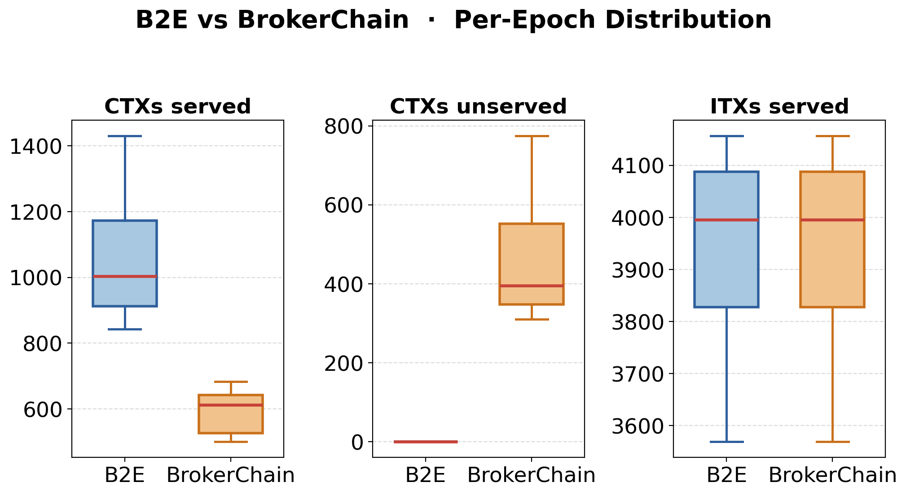

# BlockEmulator · Broker2Earn

Implementation of **Broker2Earn (B2E)** — an incentive mechanism for the Broker role in BrokerChain sharded blockchains, on top of BlockEmulator. Companion code for:

> H. Huang, Q. Chen, et al., *"Broker2Earn: Towards Maximizing Brokers' Revenue and Cross-Shard Transactions Throughput in Sharded Blockchains"*, **IEEE INFOCOM 2024**.

This branch (`broker2earn`) is derived from the INFOCOM '22 BrokerChain conference version, with four B2E-specific additions:

1. **Blocking Injection** — each batch is fully confirmed on-chain before the next batch is injected; an epoch ends when confirmed-tx count reaches `params.InjectSpeed`.
2. **Retry Pool** — CTXs that B2E fails to allocate (broker balance shortage) enter `restBrokerRawMegPool`; B2E re-runs as broker balances recover.
3. **Transaction Filtering** — CTXs whose `value > Init_broker_Balance × ShardNum` (≈ 2 ETH × shards) are dropped at load time so they never block the retry pool.
4. **Epoch Stats** — every finished epoch appends a row to a CSV with B2E allocation counts, broker profit, etc.

For the full background, problem formulation, and approximation-ratio proofs, see the paper and **Chapter 13** of the *BlockEmulator User Manual*.

---

## Quick Start

```bash
# 1. clone this branch
git clone -b broker2earn https://github.com/HuangLab-SYSU/block-emulator.git
cd block-emulator/block-emulator

# 2. generate launch scripts (4 shards × 4 nodes, B2E enabled)
go run main.go -g -S 4 -N 4 -m 4

# 3. start all nodes
#    Windows : double-click the generated .bat
#    Linux / macOS:
bash run_IpAddr=127_0_0_1.sh
```

Results are written to `./result/` when the run finishes.





---

## Configuration

All parameters live in `params/global_config.go` as plain Go variables — no JSON needed.

```go
var (
    Block_Interval      = 5000     // block interval (ms)
    MaxBlockSize_global = 2000     // max txs per block
    InjectSpeed         = 5000     // txs injected per epoch (also epoch end threshold)
    TotalDataSize       = 500000   // total txs (epoch count = TotalDataSize / InjectSpeed)
    BatchSize           = 5000     // keep == InjectSpeed
    BrokerNum           = 50       // initial broker accounts
    NodesInShard        = 4
    ShardNum            = 4
    IterNum_B2E         = 5        // URFA iterations per epoch
    Brokerage           = 0.1      // 10% commission per CTX
    DataWrite_path      = "./result/"
    FileInput           = "./data/selectedTxs_300K.csv"
)
```

### Algorithm mode (`-m`)

| `-m` | Mode |
| :---: | --- |
| 0 | CLPA_Broker |
| 1 | CLPA |
| 2 | Broker (vanilla BrokerChain) |
| 3 | Relay (default) |
| **4** | **Broker_b2e (Broker2Earn)** |

You **must** pass `-m 4` to enable B2E.

### Node IP table

If you change `ShardNum` / `NodesInShard`, update `ipTable.json` accordingly. Key `"2147483647"` (= `0x7fffffff`) is the Supervisor:

```json
{
    "0": {"0": "127.0.0.1:32217", "1": "127.0.0.1:32227"},
    "1": {"0": "127.0.0.1:32317", "1": "127.0.0.1:32327"},
    "2147483647": {"0": "127.0.0.1:38800"}
}
```

---

## Dataset

The full dataset used in the paper — 600,000 Ethereum cross-shard transactions extracted from blocks 19,000,000–19,499,999 (intra-shard txs, contract calls, and self-transfers removed) — is hosted on Baidu Netdisk:

- File: `Tx-dataset_forB2E_600K-TXs-CHEN-Qinde-2026May12.csv`
- Link: <https://pan.baidu.com/s/1Ap8S2njayTOqTj9lB6yBzw?pwd=1234> · code `1234`

Point `FileInput` at the downloaded file and set `TotalDataSize = 600000`.

A smaller `selectedTxs_300K.csv` is bundled under `./data/` for quick smoke-testing.

---

## Output Files

```
./result/
├── supervisor_measureOutput/
│   ├── Average_TPS.csv
│   ├── Transaction_Confirm_Latency.csv
│   └── CrossTransaction_ratio.csv
├── brokerResult/
│   ├── <brokerAddr>_brokerBalance.csv
│   ├── <brokerAddr>_lockBalance.csv
│   └── <brokerAddr>_Profit.csv
└── epoch_stats/
    └── epoch_stats_Broker2Earn_inject5000_shard4.csv
```

`epoch_stats` columns:

| Column | Meaning |
| --- | --- |
| `Epoch` | epoch index (0-based) |
| `Tx_injection_speed` | txs injected this epoch |
| `CTXs_served_by_Alg` | CTXs successfully allocated to brokers by B2E |
| `CTXs_unserved_by_Alg` | CTXs B2E could not allocate (broker balance shortage) |
| `CTXs_served_by_Broker` | CTXs actually confirmed via broker on-chain this epoch |
| `ITX_count_handled_thisEpoch` | intra-shard txs confirmed this epoch |
| `Total_Profit_ETH` | cumulative broker profit through this epoch (ETH) |
| `Active_Broker_Count` | active broker accounts |
| `Block_Count_thisEpoch` | blocks produced this epoch |

---

## Plotting

Compare B2E against vanilla BrokerChain on the same dataset:

```python
import pandas as pd
import matplotlib.pyplot as plt

df_b2e = pd.read_csv('./epoch_stats_Broker2Earn_inject5000_shard4.csv')
df_bc  = pd.read_csv('./epoch_stats_Brokerchain_inject5000_shard4.csv')

metrics = [
    ('CTXs_served_by_Alg',          'CTXs served'),
    ('CTXs_unserved_by_Alg',        'CTXs unserved'),
    ('ITX_count_handled_thisEpoch', 'ITXs served'),
]
palette = [('#A8C8E1', '#2E5F9C'), ('#F2C28C', '#C9701B')]

fig, axes = plt.subplots(1, len(metrics), figsize=(3.4 * len(metrics), 5.6))
for ax, (col, label) in zip(axes, metrics):
    data = [df_b2e[col].dropna().values, df_bc[col].dropna().values]
    bp = ax.boxplot(data, patch_artist=True, widths=0.6,
                    medianprops=dict(color='#C8423A', linewidth=2.4),
                    flierprops=dict(marker='o', markersize=6, alpha=0.6,
                                    markerfacecolor='#888888',
                                    markeredgecolor='#888888'))
    for i, (face, edge) in enumerate(palette):
        bp['boxes'][i].set_facecolor(face)
        bp['boxes'][i].set_edgecolor(edge)
        bp['boxes'][i].set_linewidth(2.0)
        for line in (bp['whiskers'][2*i], bp['whiskers'][2*i+1],
                     bp['caps'][2*i],     bp['caps'][2*i+1]):
            line.set_color(edge); line.set_linewidth(1.8)
    ax.set_xticks([1, 2])
    ax.set_xticklabels(['B2E', 'BrokerChain'], fontsize=17)
    ax.set_title(label, fontsize=17, fontweight='bold')
    ax.tick_params(axis='y', labelsize=17)
    ax.grid(True, axis='y', linestyle='--', alpha=0.45)

fig.suptitle('B2E vs BrokerChain · Per-Epoch Distribution',
             fontsize=20, fontweight='bold')
plt.tight_layout(rect=[0, 0, 1, 0.91])
plt.savefig('B2E_vs_BrokerChain_boxplot.pdf', dpi=300, bbox_inches='tight')
plt.show()
```



---

## Notes

- On Linux/macOS, if a `.sh` script reports permission denied, run it via `bash run_*.sh` directly.
- If a run aborts but node processes are still alive: `pkill -9 -f "go run main.go"` (Linux/macOS), or kill the `go.exe` processes from Task Manager (Windows).
- Blocking injection waits for each batch to fully confirm, so total wall time scales with `Block_Interval`. To shorten runs, lower `TotalDataSize` or `Block_Interval`.

---

## Citation

```bibtex
@inproceedings{chen2024broker2earn,
  title     = {Broker2Earn: Towards Maximizing Brokers' Revenue and Cross-Shard Transactions Throughput in Sharded Blockchains},
  author    = {Chen, Qinde and Huang, Huawei and others},
  booktitle = {IEEE INFOCOM 2024},
  year      = {2024}
}

@inproceedings{huang2022brokerchain,
  title     = {BrokerChain: A Cross-Shard Blockchain Protocol for Account/Balance-based State Sharding},
  author    = {Huang, Huawei and others},
  booktitle = {IEEE INFOCOM 2022},
  year      = {2022}
}
```

Please also cite the BlockEmulator project. See **Chapter 13** of the *BlockEmulator User Manual* for the step-by-step reproduction guide.
