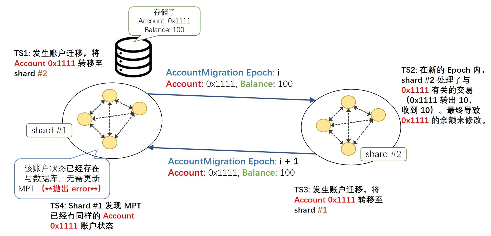

# AddAccount 函数抛出空指针异常

## 问题描述
在使用 CLPA 算法时，共识节点在进行账户迁移时，调用 `AddAccount` 函数，而这个函数有概率抛出异常。

## 原因分析
函数在调用 `./chain/blockchain.go` 文件中的 `AddAccount(ac []string, as []*core.AccountState, miner int32)` 函数时，如果**更新的账户状态已经存在于 MPT 中**，那么方法 `err = bc.triedb.Update(trie.NewWithNodeSet(ns))` 就会抛出异常。

Tips：在 `AddAccount` 中，一共有 3 个参数，第一个参数 ac 指的是账户地址，第二个参数是 as 指的是账户状态，第三个参数是 miner 指的是当前的矿工。其中，第一个参数 ac 和 第二个参数 as 是以数组的形式给出的，具有相同 index 的 ac 和 as 指的是同一个账户。比如，账户状态 as[1] 对应了 账户地址 ac[1] 的状态，账户状态 as[2] 对应了 账户地址 ac[2] 的状态。

## 问题复现

### 修复之前的代码情况

修复前的代码是这样的：

```Go
// 完整代码位于 chain/blockchain.go

func (bc *BlockChain) AddAccounts(ac []string, as []*core.AccountState, miner int32) {
	// ......

	// handle transactions to build root
	rt := bc.CurrentBlock.Header.StateRoot
	if len(ac) != 0 {
		// ......

		rrt, ns := st.Commit(false)
		err = bc.triedb.Update(trie.NewWithNodeSet(ns))
		if err != nil {
			log.Panic(err) // 由这一行抛出的错误
		}
		err = bc.triedb.Commit(rrt, false)
		if err != nil {
			log.Panic(err)
		}
		rt = rrt.Bytes()
	}

	// ......
}
```

修复前的代码仅仅是**检查了 len(ac) != 0**，防止 MPT 未更新导致的 `err = bc.triedb.Update(trie.NewWithNodeSet(ns))` 报错。

### 复现 Bug 的测试代码
可以通过运行 `chain/blockchain_test.go` 中的 `TestBlockChain` 单元测试函数，来复现这个 Bug。

```Go
// 完整代码位于 chain/blockchain_test.go

func TestBlockChain(t *testing.T) {
    // 初始化账户
	accounts := []string{"000000000001", "00000000002", "00000000003", "00000000004", "00000000005", "00000000006"}
	as := make([]*core.AccountState, 0)
	for idx := range accounts {
		as = append(as, &core.AccountState{
			Balance: big.NewInt(int64(idx)),
		})

	// ......

    // 添加账户 & 账户状态
	CurChain.AddAccounts(accounts, as, 0)
	CurChain.PrintBlockChain()

	// 添加重复的账户 & 账户状态（由于是重复的账户状态，所以底层 MPT 不会更新）
	CurChain.AddAccounts([]string{accounts[0]}, []*core.AccountState{as[0]}, 0)
	CurChain.PrintBlockChain()

	// ......
}
```


在旧版本中，这个测试用例不会导致 MPT 更新。但它绕开了 **len(ac) != 0** 的检查，从而导致报错。

运行单元测试代码 `TestBlockChain` 后，出现报错，报错信息如下：


```shell
--- FAIL: TestBlockChain (0.01s)
panic: runtime error: invalid memory address or nil pointer dereference [recovered]
        panic: runtime error: invalid memory address or nil pointer dereference
[signal 0xc0000005 code=0x0 addr=0x0 pc=0x7ff7bf8f42bc]

goroutine 19 [running]:
testing.tRunner.func1.2({0x7ff7bfab8020, 0x7ff7bfa0abc0})
        C:/Program Files/Go/src/testing/testing.go:1545 +0x238
testing.tRunner.func1()
        C:/Program Files/Go/src/testing/testing.go:1548 +0x397
panic({0x7ff7bfab8020?, 0x7ff7bfa0abc0?})
        C:/Program Files/Go/src/runtime/panic.go:914 +0x21f
github.com/ethereum/go-ethereum/trie.(*MergedNodeSet).Merge(0xc000287c08, 0x0)
        C:/Users/PC/go/pkg/mod/github.com/ethereum/go-ethereum@v1.11.6/trie/nodeset.go:212 +0x1c
github.com/ethereum/go-ethereum/trie.NewWithNodeSet(...)
        C:/Users/PC/go/pkg/mod/github.com/ethereum/go-ethereum@v1.11.6/trie/nodeset.go:205
blockEmulator/chain.(*BlockChain).AddAccounts(0xc0002200c0, {0xc000287ec0, 0x1, 0x1?}, {0xc000287e88, 0x1, 0x7ff7bf9c9920?}, 0xb3f28?)
        d:/workspace_projects/block-emulator/chain/blockchain.go:337 +0x625
blockEmulator/chain.TestBlockChain(0x0?)
        d:/workspace_projects/block-emulator/chain/blockchain_test.go:46 +0x46a
testing.tRunner(0xc000104b60, 0x7ff7bfbd9f18)
        C:/Program Files/Go/src/testing/testing.go:1595 +0xff
created by testing.(*T).Run in goroutine 1
        C:/Program Files/Go/src/testing/testing.go:1648 +0x3ad
FAIL    blockEmulator/chain     0.141s
```

如此便复现了 Bug 出现的场景。

### 修复之后的代码

修复之后的代码仅仅是加上了一行 `ns != nil` 的判断：

```Go
// 完整代码位于 chain/blockchain.go

func (bc *BlockChain) AddAccounts(ac []string, as []*core.AccountState, miner int32) {
	// ......

	// handle transactions to build root
	rt := bc.CurrentBlock.Header.StateRoot
	if len(ac) != 0 {
		// ......

		rrt, ns := st.Commit(false)

        // 增加了一行 ns 不为 nil 的判断
		// if `ns` is nil, the `err = bc.triedb.Update(trie.NewWithNodeSet(ns))` will report an error.
		if ns != nil {
			err = bc.triedb.Update(trie.NewWithNodeSet(ns))
			if err != nil {
				log.Panic(err)
			}
			err = bc.triedb.Commit(rrt, false)
			if err != nil {
				log.Panic(err)
			}
			rt = rrt.Bytes()
		}
	}

	// ......
}
```

再运行测试代码，便不会出错：

```shell
go test -timeout 30s -run ^TestBlockChain$ blockEmulator/chain
=== RUN   TestBlockChain
--- PASS: TestBlockChain (0.02s)
PASS
ok      blockEmulator/chain     0.144s
```

## 触发 Bug 的场景分析
上述讨论都是分析 Bug 在区块链的数据层面是如何触发的。

而 BlockEmulator 中，触发这种 Bug 并不是一个共识节点导致的，而是整个共识流程导致的。接下来将会分析可能出现这种 Bug 的场景。



1. 在上述场景中，一开始账户 *0x1111* 位于 shard #1 内。Shard #1 内的数据库存储了 Account:0x1111 的状态 Balance: 100（该账户状态是简化后的版本）。
2. 在 TS1 时，区块链系统发生了账户迁移，账户 *0x1111* 将从 shard #1 迁移至 shard #2。
3. 在 TS2 时，账户 *0x1111* 已经位于了 shard #2 中。Shard #2 的共识节点将会处理与 *0x1111* 有关的交易。这里举了一个例子，***0x1111* 转出 10，又收到 10**。**这将会导致 *0x1111* 的最终余额并没有发生变化**。（因为先版本的 blockEmulator 并没有考虑手续费。）
4. 在 TS3 时，区块链系统又发生了账户迁移，账户 *0x1111* 将从 shard #2 迁移回 shard #1。
5. 在 TS4 时，shard #1 内的共识节点利用 `AddAccount` 函数处理新到来的 账户 *0x1111* 的状态 Balance：100。**`AddAccount` 函数发现这个状态已经存在于底层数据库中，所以不需要做出 MPT 的更新，故而抛出 error**。