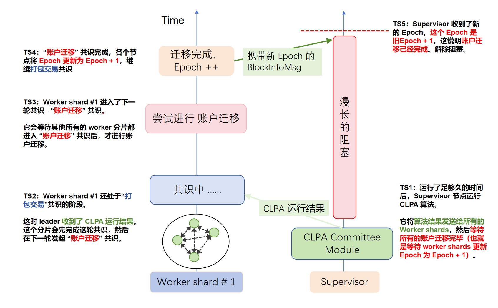

# CLPACommitteeModule 出现死循环

该 issue 链接为：https://github.com/HuangLab-SYSU/block-emulator/issues/42

## 问题描述
使用 CLPA 类算法跑实验时，如果将分片数目设置为 1，那么 CLPACommitteeModule 会卡住不动。

## 代码定位
代码的图示解释是这样的：
代码的处理逻辑：


Bug 出现的位置：


CLPA 类方法的代码执行逻辑是这样的：Supervisor 执行 CLPA 算法，然后将结果分发给 Worker 分片。然后Worker 分片根据 CLPA 算法的结果更新本地数据、进行账户迁移。这一系列操作完成后，Worker 分片会将自己本地的 Epoch 自增 1。然后，在下一次出块时，Worker 分片会将区块信息发送给 Supervisor，其中包含了自己当前的 Epoch。而 Supervisor 的 `CLPACommitteeModule` 收到了 worker 发送的 `BlockInfoMsg，发现` Worker 分片已经进入了新的 Epoch，所以 Supervisor 也更新本地的 `ccm.curEpoch`。此时，`ccm.curEpoch== clpaCnt`，Supervisor 跳出循环，继续执行。

下面是结合代码的解释：

卡住不动的代码位于下图的 15~17 行。在分片数目为 1 的情况下，`ccm.curEpoch` 始终不等于 `clpaCnt`，所以代码陷入了死循环。

```Go
// 原先出现 Bug 的代码位于 supervisor\committee\committee_clpa.go

if !ccm.clpaLastRunningTime.IsZero() && time.Since(ccm.clpaLastRunningTime) >= time.Duration(ccm.clpaFreq)*time.Second {
    ccm.clpaLock.Lock()
    clpaCnt++
    mmap, _ := ccm.clpaGraph.CLPA_Partition()

    ccm.clpaMapSend(mmap)
    for key, val := range mmap {
        ccm.modifiedMap[key] = val
    }
    ccm.clpaReset()
    ccm.clpaLock.Unlock()

    for atomic.LoadInt32(&ccm.curEpoch) != int32(clpaCnt) {
        time.Sleep(time.Second)
    }
    ccm.clpaLastRunningTime = time.Now()
    ccm.sl.Slog.Println("Next CLPA epoch begins. ")
}
```

而 `ccm.curEpoch` 为什么无法等于 `clpaCnt`？

在下面这份代码的第 5 行发生了 `ccm.curEpoch` 的修改，从中可见，`ccm.curEpoch` 是通过 `BlockInfoMsg` 的 `Epoch` 字段进行修改。
所以，如果 `BlockInfoMsg的` `Epoch` 字段一直没有修改，那么 `ccm.curEpoch` 也不会被修改，上述的死循环就会出现。

```Go
// 对 ccm.curEpoch 产生修改的代码位于 supervisor\committee\committee_clpa.go

func (ccm *CLPACommitteeModule) HandleBlockInfo(b *message.BlockInfoMsg) {
    ccm.sl.Slog.Printf("Supervisor: received from shard %d in epoch %d.\n", b.SenderShardID, b.Epoch)
    if atomic.CompareAndSwapInt32(&ccm.curEpoch, int32(b.Epoch-1), int32(b.Epoch)) {
        ccm.sl.Slog.Println("this curEpoch is updated", b.Epoch)
    }
    ......
}    
```

为什么 `BlockInfoMsg` 的 `Epoch` 字段没有被修改？因为 BlockEmulator 是事件驱动型（event-driven）。从下面的代码可以看到，（leader节点）代码会卡死在第 6 行的循环里。
当 leader 节点卡死后，view-change 就会触发，选举出新的 leader，新的 leader忽视上一轮的账户迁移，所以 Epoch 保持不变。不变的 Epoch 导致了 Supervisor 端的死循环。 

```Go
// 该代码位于 consensus_shard\pbft_all\pbftInside_moduleCLPA.go

func (cphm *CLPAPbftInsideExtraHandleMod) HandleinPropose() (bool, *message.Request) {
    if cphm.cdm.PartitionOn {
        cphm.sendPartitionReady()
        for !cphm.getPartitionReady() {
            time.Sleep(time.Second)
        }
        // send accounts and txs
        cphm.sendAccounts_and_Txs()
        // propose a partition
        for !cphm.getCollectOver() {
            time.Sleep(time.Second)
        }
        return cphm.proposePartition()
    }
    ...
}
```
## 解决方案

简单的解决方案是，仅当 分片数目大于 1 时，才运行 CLPA 算法。

```Go
// 修复 Bug 的代码位于 supervisor\committee\committee_clpa.go
if params.ShardNum > 1 && !ccm.clpaLastRunningTime.IsZero() && time.Since(ccm.clpaLastRunningTime) >= time.Duration(ccm.clpaFreq)*time.Second {
    ccm.clpaLock.Lock()
    clpaCnt++
    mmap, _ := ccm.clpaGraph.CLPA_Partition()

    ccm.clpaMapSend(mmap)
    for key, val := range mmap {
        ccm.modifiedMap[key] = val
    }
    ...
}
```