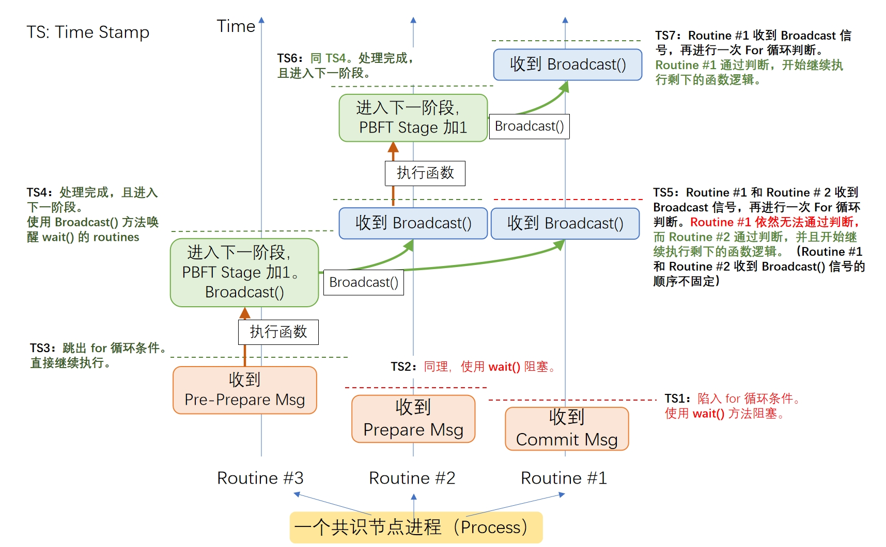

# PBFT 共识间隔设置
**2024.10.22 测试：2024年9月提交在 GitHub 的代码可以将 PBFT 出块间隔设置为0且正常运作。**

## 问题描述
 PBFT 共识协议的出块间隔，即 “Block_Interval” 参数被设置为 0 或很低的值时，该分片节点收到的消息可能会乱序。这种情况会导致错位的区块无法通过区块合法性验证，进而导致共识中止。

## 引发原因
（后续出现问题可以在此定位）

### 1. BlockEmulator 中的消息处理逻辑***

BlockEmulator 被设计为一个事件驱动（event-driven）型的模拟器。

当共识节点收到消息这一事件时，它会触发消息处理函数 “`handleMessage`”，根据消息头 “`msgType`” 的类型，选择处理消息的逻辑（`handlePrePrepare`，`handlePrepare`，`handleCommit`）。

**引发原因**：在之前存在 Bug 的版本中，节点并没有使用 go routine 并发处理消息。也就是说，节点会按照接收消息的顺序来依序处理消息。但是，在 “`Block_Interval`” 参数很小的情况下，消息的到达顺序是无法预测且不合人意的，所以消息错位就会导致 PBFT 共识的处理逻辑错误。
    
**比如在收到 PrePrepare 消息之前收到了同一个 proposal 的 Commit 消息，那么节点先处理 Commit 消息，则会发现无法识别到这个 proposal，所以 `handleCommit` 函数无法帮助节点 commit 这个 proposal。哪怕之后处理了该 proposal 的 PrePrepare 消息，由于上述 commit 消息已经处理过了，节点不会再触发 `handleCommit` 函数。这会导致该节点迟迟无法 commit。**


```Go
// 旧版本存在 BUG 的 BlockEmulator 的消息处理函数

func (p *PbftConsensusNode) handleMessage(msg []byte) {
    msgType, content := message.SplitMessage(msg)
    switch msgType {
    // pbft inside message type
    case message.CPrePrepare:
        p.handlePrePrepare(content)
    case message.CPrepare:
        p.handlePrepare(content)
    case message.CCommit:
        p.handleCommit(content)
        
        // ......
}
```


## 解决方案
    
主要的解决方案是利用 Go routine 和 几个 PBFT 的字段来控制 PBFT 的消息处理顺序，防止共识节点由于消息错位导致共识失败。

### 1. 利用 Go routine 并行的消息处理

在当前已修复 Bug 的版本中，共识节点在处理 PrePrepare，Prepare，Commit 消息时，它会使用 go routine 启动一个线程，并发地处理消息。


```Go
// 已修复 BUG 的 BlockEmulator 的消息处理函数
// 该函数利用 Go routine 处理各个 PBFT 共识消息

func (p *PbftConsensusNode) handleMessage(msg []byte) {
    msgType, content := message.SplitMessage(msg)
    switch msgType {
    // pbft inside message type
    case message.CPrePrepare:
        // use "go" to start a go routine to handle this message, so that a pre-arrival message will not be aborted.
        go p.handlePrePrepare(content)
    case message.CPrepare:
        // use "go" to start a go routine to handle this message, so that a pre-arrival message will not be aborted.
        go p.handlePrepare(content)
    case message.CCommit:
        // use "go" to start a go routine to handle this message, so that a pre-arrival message will not be aborted.
        go p.handleCommit(content)
        // ......
}
```


### 2. 用于控制 PBFT 消息处理顺序的辅助字段

从代码上看，程序是由这几个字段（`pbftStage`, `pbftLock`, `conditionalVarPbftLock`）来控制 PBFT 共识协议的进度。 其中，变量 `conditionalVarpbftLock` 使用了 sync.Cond，关于 go 中条件变量（conditional variable）的使用可以见：  https://pkg.go.dev/sync#Cond。

简而言之，conditional variable 能够同时释放多个被阻塞的线程，BlockEmulator 用它保证节点收到的消息被按序执行。

```Go
type PbftConsensusNode struct {
    // ......
    // pbft stage wait
    pbftStage              atomic.Int32 // 1->Preprepare, 2->Prepare, 3->Commit, 4->Done
    pbftLock               sync.Mutex
    conditionalVarpbftLock sync.Cond
    // ......
}
```


接下来消息介绍这三个变量在代码中的作用。

- `pbftStage`

    这个变量用来表示当前 PBFT 共识处于哪个阶段。或者说，这个变量表明了目前该节点可以处理哪些消息（1->Preprepare, 2->Prepare, 3->Commit, 4->Done）。
  
- `pbftLock & conditionalVarpbftLock` 

  这两个变量是需要一起使用的。在创建 PbftConsensusNode 时，代码会将 pbftLock 和 conditionalVarpbftLock 绑定。


```Go
// 以 &p.pbftLock 为参数创建 p.conditionalVarpbftLock
p.conditionalVarpbftLock = *sync.NewCond(&p.pbftLock)
```

### 3. 代码的消息处理逻辑
当节点收到一个消息后，它会启动一个 go routine 线程，来处理消息。

```Go
func (p *PbftConsensusNode) handlePrepare(content []byte) {
    // 对消息进行解码
    // ......
    // 控制消息按照共识流程的顺序被处理
    curView := p.view.Load()
    p.pbftLock.Lock()
    defer p.pbftLock.Unlock()
    for p.pbftStage.Load() < 2 && pmsg.SeqID >= p.sequenceID && p.view.Load() == curView {
        p.conditionalVarpbftLock.Wait()
    }
    defer p.conditionalVarpbftLock.Broadcast()

    // if this message is out of date, return.
    if pmsg.SeqID < p.sequenceID || p.view.Load() != curView {
        return
    }
    
    // 该类消息的处理逻辑
    // ......
    
    // 如果收到足够多的 PrePare 消息，那么进入 Commit 阶段
    p.pbftStage.Add(1)
}
``` 

以处理 prepare 消息的函数为例，这个线程可能会受到阻塞（第6行使用 pbftLock 进行了加锁，第9行使用 `conditionalVarpbftLock` 进行阻塞。也就是说，如果 第8行 for 循环的条件判断为 true，那么这个进程将会被 `wait()` 方法阻塞）。
  - 首先是第8行的 for 循环条件。`p.pbftStage.Load() < 2` 这个条件确保了，共识节点处于pbftStage = 1（preprepare）阶段时，Prepare 消息不会被处理（如果被处理就相当于消息乱序了）。 `pmsg.SeqID >= p.sequenceID` 条件确保了，`p.pbftStage.Load() < 2` 这个条件阻塞的是当前这一轮 PBFT 共识的消息。

  - 如果一个消息处理函数跳出了 for 循环，它会首先检查该消息是否已经过时（out of date，由第 14 行的代码进行判断），如果过时则直接结束函数，否则按照该类消息的处理逻辑处理。

  - 在该类消息处理逻辑的末尾，如果节点可以进入下一阶段（比如，节点已经收到了当前 PBFT 轮次的足够多的 Prepare 消息），那么第 23 行代码会触发 `p.pbftStage.Add(1)`。

  - 最后，由于第 11 行使用了 defer 指令（`defer p.conditionalVarpbftLock.Broadcast()`），在程序返回时，该程序还会用 `Broadcast()` 方法，解除其他所有线程的 `wait()` 阻塞。这样，其他进程会再次进行第8行的for 循环判断，并且尝试跳出循环。

