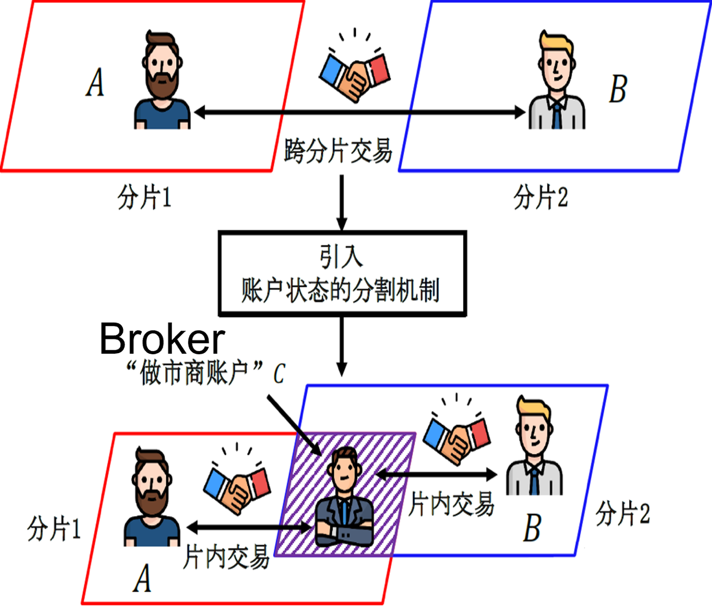

# BrokerChain 技术文档

## 一、背景

BrokerChain 跨分片机制，来自于 INFOCOM2022 收录的论文 《[BrokerChain: A Cross-Shard Blockchain Protocol for Account/Balance-based State Sharding](https://www.researchgate.net/publication/356789473_BrokerChain_A_Cross-Shard_Blockchain_Protocol_for_AccountBalance-based_State_Sharding)》, 论文针对目前分片区块链系统中存在大量跨分配交易的问题提出了 BrokerChain 跨分片交易机制，即，将选定为 Broker 的账户的状态进行分割，使其存在于每个分片之中，当分片间出现跨分片交易的时候，就可以使用 Broker 来进行处理。如下图所示：



图 1. “做市商账户”交易机制

Broker 账户也就是“做市商账户”，运用状态分割技术，让每个分片中存在 Broker，当用户提交了一个跨分片交易，如某分片的账户 A 向另一个分片的账户 B 发起一笔交易，那么这一笔跨分片交易就可以拆解为两笔片内交易，分别为账户 A 和同分片的 Broker 账户 C 进行一笔交易以及账户 B 和同分片的 Broker 账户 C 进行一笔交易，当交易完成后，实现跨分片交易处理，以减少跨分片交易的数量。


图 2. 交易执行时序图

如上图，描述的是一笔由 Broker 服务的跨分片交易的执行时序图，具体的流程如下（源自 [BrokerChain 论文](https://www.researchgate.net/publication/356789473_BrokerChain_A_Cross-Shard_Blockchain_Protocol_for_AccountBalance-based_State_Sharding)）：

- Op1 : Sender A 发送原始交易消息 $θ_{raw}$给  Broker C 
- Op2 : BrokerC 收到原始消息 $θ_{raw}$ 后，分别给原始交易发送方账户和接收方账户所在分片（图中 Shard1、Shard2 ）发送 $θ_{1}$
- Op3：Shard1 节点接收到 $θ_{1}$ 后，判断消息合法性，构建 A 和 C 之间的交易（Tx1），如果交易上链，则向 Broker 发送Confirm $θ_{1}$消息
- Op4：Broker 接收到 Confirm $θ_{1}$消息，验证消息的有效性后，向 Shard2 发送 $θ_{2}$
- Op5：Shard2 节点接收到 $θ_{2}$ 后，判断消息合法性，构建 C 和 B 之间的交易（Tx2），，如果交易上链，则向 Broker 发送Confirm $θ_{2}$消息完成跨分片交易
- 

## **二、Broker 设计**

### **1. 结构设计**

- **Sender** ：目前 Sender 为supervisor 担任。
  - 负责检测接收的交易是否为跨分片交易，如果是跨分片交易，则生成 $θ_{raw}$，并发送给 Broker
  - 负责处理来自 Broker 的 $θ_{1}$ ，主要步骤为验证消息、生成 Tx1 片内交易、添加 Tx1 到交易池
  - 负责处理来自 Broker 的 $θ_{2}$ ，主要步骤为验证消息、生成  Tx2 片内交易、添加 Tx2 到交易池
  - 当新的区块打包上链后，负责筛选 BrokerTx，并分别生成 $Confirmθ_{1}$和 $Confirmθ_{2}$发送给 Broker
- **Broker** ：Broker 为 supervisor 担任，专门负责跨分片交易请求
  - **BrokerAddress** : 在分片区块链网络中，Broker 账户将会被分割到各个分片中，也就是说 Broker 将拥有和分片数量对应的 account ，且 brokerAccount 不参与区块链网络的状态迁移。
    - 如 A → B，A 在 1 分片，B 在 2 分片， Broker 检测到跨分片交易后，经过一系列信息交换，跨分片交易变为 A → BrokerAddress 和 BrokerAddress → B 

  


## 三、Broker **代码实现**

Broker 的实现分为两个部分，第一部分是 Broker 实例，第二部分是 Broker 相关消息结构的实现。

### **1. Broker 实例**

Broker 实例包含了与 Broker 相关的一些变量，用来存储处理过程中生成的信息。下面是 Broker 的数据结构：

```Go
type Broker struct {
    BrokerRawMegs  map[string]*message.BrokerRawMeg
    ChainConfig    *params.ChainConfig
    BrokerAddress  []string
    RawTx2BrokerTx map[string][]string
}
```

| 变量             | 类型                    | 说明                                      |
| ---------------- | --------------------- | ----------------------------------------- |
| `BrokerRawMegs`  | `map[string]*BrokerRawMeg ` | RawMeg 摘要和`*BrokerRawMeg `的映射       |
| `ChainConfig`    | `*params.ChainConfig` | 系统配置信息                              |
| `BrokerAddress`  | `[]string`            | Broker 地址                         |
| `rawTx2BrokerTx` | `map[string][]string` | 原始跨分片交易和 Broker 产生的两个片内交易的映射 |

同时 Broker 实例提供了必要的功能，以下是各个功能对应的方法：

```Go
// generate a new broker
func NewBroker(pcc *params.Cha in config)

// get the digest of rawMeg
func getBrokerRawMagDigest(r *message.BrokerRawMeg) []byte 
 
// Get parition (if not exist, return default)
func fetchModifiedMap(key string) uint64 

// Handle the raw messsage 
func handleBrokerRawMag(brokerRawMags []*message.BrokerRawMeg) 

// Handle the tx1 
func handleTx1ConfirmMag(mag1confirms []*message.Mag1Confirm) 

// Handle the tx2
func handleTx2ConfirmMag(mag2confirms []*message.Mag2Confirm)

//init broker address
func initBrokerAddr(num int) []string 
```

### 2. 消息结构

#### 2.1. 消息类型

$θ_{raw}$：Sender 向 Broker 发送的原始交易的消息 

```Go
type BrokerRawMeg struct {
    Tx        *core.Transaction
    Broker    utils.Address
    Hlock     uint64 //ignore
    Snonce    uint64 //ignore
    Bnonce    uint64 //ignore
    Signature []byte // not implemented now.
}
```

$θ_{1}$：Broker 向原始交易的发起者所在分片发送的信息。

```Go
type BrokerType1Meg struct {
    RawMeg   *BrokerRawMeg
    Hcurrent uint64        //ignore
    Signature []byte // not implemented now.
    Broker   utils.Address 
}
```

$Confirmθ_{1}$：原始交易发起者账户所在分片将 Tx1 上链后，向 Broker 发送的确认信息。

```Go
type mag1Confirm struct {
    Tx1Hash []byte
    RawMeg  *BrokerRawMeg
}
```

$θ_{2}$：Broker 向原始交易的接收者所在分片发送的信息。

```Go
type BrokerType2Meg struct {
    RawMeg *BrokerRawMeg
    Signature []byte // not implemented now.
    Broker utils.Address 
}
```

$Confirmθ_{2}$：原始交易的接收者所在分片, 将 Tx2 上链后，向 Broker 发送的确认信息。

```Go
type mag2Confirm struct {
    Tx2Hash []byte
    RawMeg  *BrokerRawMeg
}
```

以上的消息结构都提供了该有的使用方法：

| `handleBrokerRawMag(brokerRawMags []*message.BrokerRawMeg) ` | 处理原始消息，产生并发送 $θ_{1}$    |
| ------------------------------------------------------------ | ------------------------------------- |
| `handleTx1ConfirmMag(mag1confirms []*message.Mag1Confirm) `  | 处理 $Confirmθ_{1}$，发送 $θ_{2}$ |
| `handleTx2ConfirmMag(mag2confirms []*message.Mag2Confirm) `  | 处理 $Confirmθ_{2}$，记录结果 |
| `fetchModifiedMap(key string) uint64 `                       | 用于判断交易中账户所属分片                |

### 2.2 缓存池

主要用于交易处理流程中缓存 $Confirmθ_{1}$和 $Confirmθ_{2}$消息，因为 Confirm 确认消息需要在交易上链之后才进行处理，所以需要用缓存池将 Confirm 消息缓存。

```Go
brokerConfirm1Pool = make(map[string]*mag1Confirm)
brokerConfirm2Pool = make(map[string]*mag2Confirm)
```

缓存池也提供了对应的使用方法：

| `dealTxByBroker(txs []*core.Transaction) (itxs []*core.Transaction)` | 采用 Broker 交易进行跨分片交易处理，输入为代注入交易，输出为片内交易，同时生成 RawMeg，并发送给 Broker |
| ------------------------------------------------------------ | ------------------------------------------------------------ |
| `handleBrokerType1Mes(brokerType1Megs []*message.BrokerType1Meg)  ` | 处理来自 Broker 的 $θ_{1}$，解析消息并，生成片内交易 Tx1，并加入交易池 |
| `handleBrokerType2Mes(brokerType2Megs []*message.BrokerType2Meg)  ` | 处理来自 Broker 的 $θ_{2}$，解析消息并，生成片内交易 Tx2，并加入交易池 |
| `createConfirm(txs []*core.Transaction)`                     | 当区块链上链后，区块中交易记录，分别产生 $Confirmθ_{1}$和 $Confirmθ_{2}$发送给 Broker 进行处理 |
