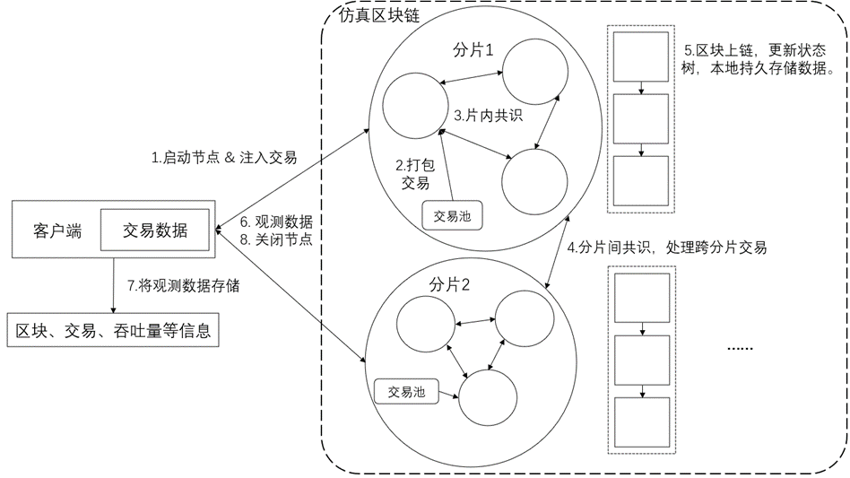

# 运行流程

整个 BlockEmulator 的运行周期可以分为三个阶段：运行前进行参数配置、运行中以及运行后进行数据收集。

1. 运行前进行参数配置。

   这一步参考第二章第一节的 BlockEmulator 具体配置，在那一节有详细的配置教程。

   1. 

   2.   **系统运行周期**

2. 运行中。

    在进行好运行前的参数配置之后，整个模型启动，大致按照如下的步骤：

   1. 客户端启动（Supervisor [Supervisor 技术文档](./supervisor.md)  启动 ），准备好读入交易数据，同时启动仿真区块链，客户端开始注入交易。
   2. 每个节点按照用户设定的规则，在每个分片对应的交易池中打包一定数量的交易，生成区块。
   3. 在生成区块之后，按照用户设定的共识协议对区块进行共识。
   4. 如果模拟的是多分片的区块链系统，那么系统还会根据用户设定的跨分片交易协议处理跨分片交易。
   5. 在区块达成共识之后，每个节点将达成共识的区块进行上链，更新节点的状态树，在本地持久存储数据。
   6. 在仿真区块链运行的时候，客户端（Supervisor）持续的观察整个仿真区块链运行的情况。
   7. 客户端（Supervisor）观察仿真区块链运行的时候，会将相关的数据存储起来，比如生成的区块信息、交易信息、吞吐量等等，用户可以自行设定。
   8. 最后，客户端（Supervisor）在观察到所有的交易都已经全部上链之后，会通知所有的区块链节点关闭运行。

1. 运行后进行数据收集。 这一步参考**第二章第六节指标**和**第二章第七节日志**，在那两节有对测试指标的详细描述以及日志生成的描述。
