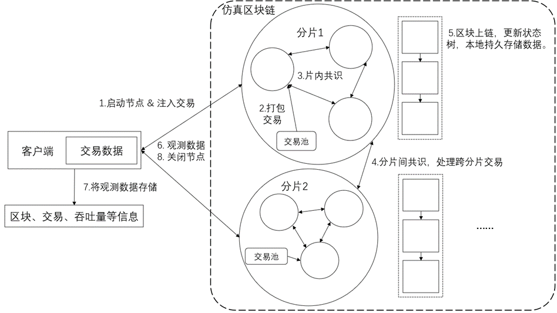

# Supervisor 技术文档

## 一、背景

- Supervisor 扮演者系统的客户端角色，其不参与共识，主要负责消息的处理和发送，在设计上允许其和各个分片的各个节点进行通信，其主要负责的工作如下：
  - 为共识节点传播交易信息
  - 为共识节点设置共识协议与跨分片机制
  - 记录交易的处理数据，计算并输出系统性能
  - 控制全局节点的开始与终止
  - 

**系统结构图**

## 二、结构

Supervisor 主要由四部分组成，基础结构、终止信号、测量模块、委员会模块

### 基础结构

Supervisor 为了可以实现全局的消息通信，需要知道分片区块链网络中各个节点的具体地址以及系统配置信息，同时作为节点，需要设置相应的 TCP 端口以及 log 日志信息

```Go
IPaddr       string // ip address of this Supervisor
ChainConfig  *params.ChainConfig
Ip_nodeTable map[uint64]map[uint64]string
tcpLn      net.Listener
sl *supervisor_log.SupervisorLog // logger module
```

### 终止信号

负责对全局网络的节点的终止信息发送

```Go
listenStop bool
Ss *signal.StopSignal // to control the stop message sending
```

### 测量模块

负责测试区块链的各类性能，如TPS、延迟、跨分片交易率等

```Go
testMeasureMods []measure.MeasureModule
```

MeasureModule 以接口的方法定义，根据用户的需要定制化实现对应测试模块

```Go
type MeasureModule interface {
    UpdateMeasureRecord(*message.BlockInfoMsg)
    HandleExtraMessage([]byte)
    OutputMetricName() string
    OutputRecord() ([]float64, float64)
}
```

### 委员会模块

负责设置定义区块链系统使用的共识协议以及跨分片共识机制，如PBFT、Relay、BrokerChain、CLPA

```Go
comMod committee.CommitteeModule
```

CommitteeModule 同样采用接口的方式实现，根据用户的需要定制化实现对应测试模块

```Go
type CommitteeModule interface {
    AdjustByBlockInfos(*message.BlockInfoMsg)
    TxHandling()
    HandleOtherMessage([]byte)
}
```

## 三、使用方法

### 实现 MeasureModule

用户可以实验需要自定义测试指标，实现MeasureModule提供的接口，并添加到Supervisor初始化中。

| `UpdateMeasureRecord(*message.BlockInfoMsg)` | 接收上链区块链信息，更新测试指标数据 |
| -------------------------------------------- | ------------------------------------ |
| `HandleExtraMessage([]byte)`                 | 预留接口，用于额外需求拓展           |
| `OutputMetricName() string`                  | 测量指标名称                         |
| `OutputRecord() ([]float64, float64)`        | 测量结果                             |

此外，在系统中已经默认提供的若干测量模块，具体如下：

```Go
switch mModName {
case "TPS_Relay":
    d.testMeasureMods = append(d.testMeasureMods, measure.NewTestModule_avgTPS_Relay())
case "TPS_Broker":
    d.testMeasureMods = append(d.testMeasureMods, measure.NewTestModule_avgTPS_Broker())
case "Latency_Relay":
    d.testMeasureMods = append(d.testMeasureMods, measure.NewTestModule_Latency_Relay())
case "Latency_Broker":
    d.testMeasureMods = append(d.testMeasureMods, measure.NewTestModule_Latency_Broker())
case "CrossTxRate_Relay":
    d.testMeasureMods = append(d.testMeasureMods, measure.NewTestCrossTxRate_Relay())
case "CrossTxRate_Broker":
    d.testMeasureMods = append(d.testMeasureMods, measure.NewTestCrossTxRate_Broker())
case "TxNumberCount_Relay":
    d.testMeasureMods = append(d.testMeasureMods, measure.NewTestTxNumCount_Relay())
case "TxNumberCount_Broker":
    d.testMeasureMods = append(d.testMeasureMods, measure.NewTestTxNumCount_Broker())
default:
}
```

### 实现 CommitteeModule

根据需要测试的方法以及测试指标，实现MeasureModule提供的接口，并添加到Supervisor初始化中。

| `AdjustByBlockInfos(*message.BlockInfoMsg)` | 接收上链区块链信息，用于实现不同跨分片机制 |
| ------------------------------------------- | ------------------------------------------ |
| `TxHandling()`                              | 读取交易文件并负责交易处理与广播           |
| `HandleOtherMessage([]byte)`                | 预留接口，实现拓展                         |

在系统中已经默认提供的若干测量模块

```Go
switch committeeMethod {
case "CLPA_Broker":
    d.comMod = committee.NewCLPACommitteeMod_Broker(d.Ip_nodeTable, d.Ss, d.sl, params.FileInput, params.TotalDataSize, 16000, 50)
case "CLPA":
    d.comMod = committee.NewCLPACommitteeModule(d.Ip_nodeTable, d.Ss, d.sl, params.FileInput, params.TotalDataSize, 16000, 50)
case "Broker":
    d.comMod = committee.NewBrokerCommitteeMod(d.Ip_nodeTable, d.Ss, d.sl, params.FileInput, params.TotalDataSize, 16000)
default:
    d.comMod = committee.NewRawCommitteeModule(d.Ip_nodeTable, d.Ss, params.FileInput, params.TotalDataSize, 16000)
}
```

### 初始化 Supervisor 

初始化 Supervisor 需要设置 Supervisor 对应的 ip 地址，区块链配置信息、committeeMethod 类型 、mearsureMod 类型

```Go
func (d *Supervisor) NewSupervisor(ip string, pcc *params.ChainConfig, committeeMethod string, mearsureModNames ...string) 
```

初始化之后，开始注入交易，并进行接口监听，接口和处理来自共识节点的消息

```Go
lsn := new(supervisor.Supervisor)
lsn.NewSupervisor(params.SupervisorAddr, initConfig(123, nnm, 123, snm), params.CommitteeMethod[mod], measureMod...)
time.Sleep(10000 * time.Millisecond)
go lsn.SupervisorTxHandling()
lsn.TcpListen()
```

目前提供的 CommitteeMethod 和 MearsureMod 如下

```Go
CommitteeMethod   = []string{"CLPA_Broker", "CLPA", "Broker", "Relay"}
MeasrureBrokerMod = []string{"TPS_Broker", "Latency_Broker", "CrossTxRate_Broker", "TxNumberCount_Broker"}
MeasrureRelayMod  = []string{"TPS_Relay", "Latency_Relay", "CrossTxRate_Relay", "TxNumberCount_Relay"}
```
